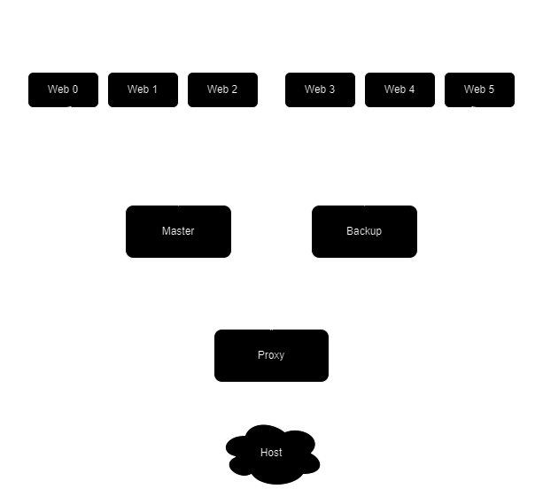

# melon

High availability docker cluster made with:
- nginx
- keepalived 
- haproxy

> Note that this is a demo project, use it for study purposes only

## Diogram

## License
**melon** is free and open source. All code in this repository is licensed under
- MIT License ([LICENSE.md](https://github.com/Maksasj/melon/blob/master/LICENSE.md) or https://opensource.org/license/mit/)